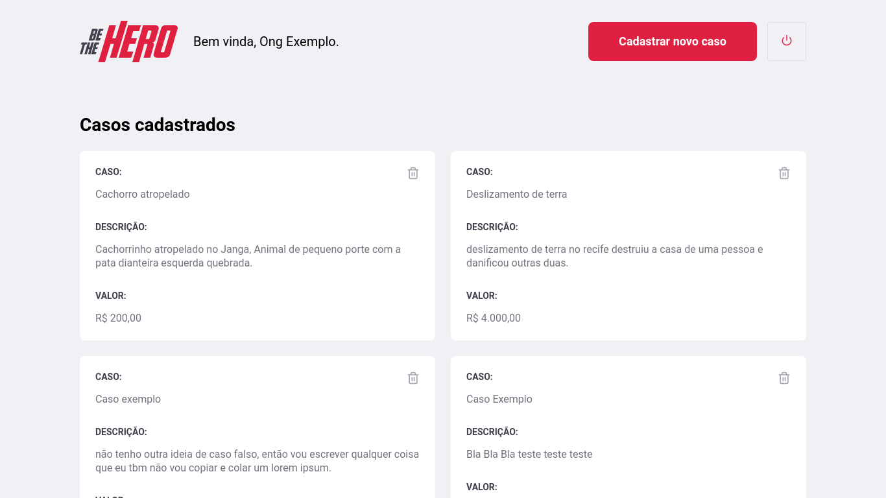

# Be-The-Hero
Projeto resultado da semana Omnistack #11

Para iniciar o projeto localmente  basta dar o comando "npm start" dentro
dentro de cada uma das páginas de acordo com qual parte da aplicação você
deseje iniciar, caso seja o mobile  será necessário utilizar o aplicativo
expo e escanear o código qr que irá aparecer na tela.

